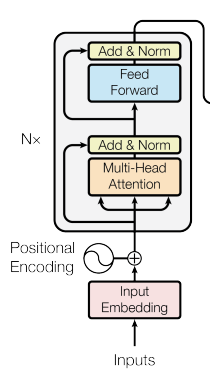
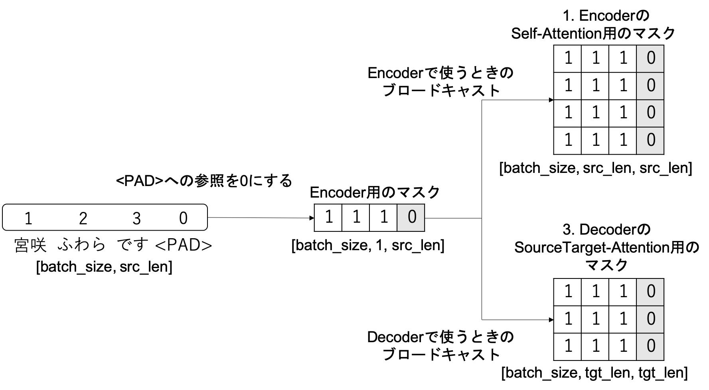
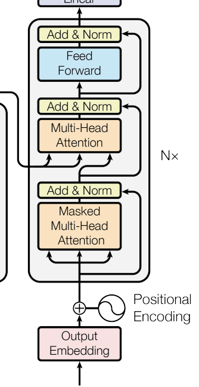
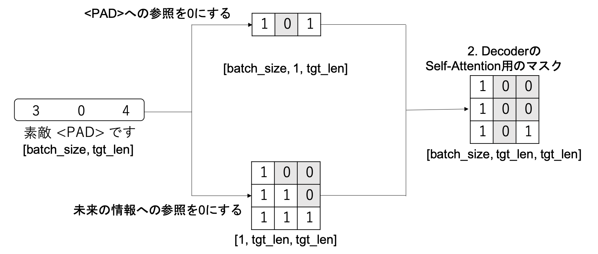

# transformer

Paper: [Attention is All You Need](https://arxiv.org/abs/1706.03762)

Reference
- [Python(PyTorch)で自作して理解するTransformer](https://zenn.dev/yukiyada/articles/59f3b820c52571)
- [The Annotated Transformer](http://nlp.seas.harvard.edu/2018/04/03/attention.html)
- [Transformerのデータの流れを追ってみる](https://qiita.com/FuwaraMiyasaki/items/239f3528053889847825)

# Memo

Transformerの特徴: RNNと違って学習時の再帰計算が必要ない

## Attention

Attentionの目的: 入力ベクトルの各要素の重要度を算出、それを利用して入力ベクトルに重み付けする(Attention Weight: 入力の重要度)

「入力ベクトル」と「Attention Weight」の積→入力ベクトルの中で正解ラベルを得る上で特に重要な要素を重み付けれる

Attention Weight = α(Q, X)

- α(): Attention Weightを求める関数
- Q: クエリ
- X: 入力

入力XにAttention Weightで重み付けしたものがAttentionの出力になる

Output = (Attention Weight)X = α(Q, X)X

よく出てくる Attention(Q, K, V)とα(Q, X)X は同じ事を意味してる

書き方を合わせると↓になる

Attention(Q, K, V) = α(Q, K)V

α(Q, X)X = Attention(Q, X ,X)

**QとXが同じかどうか**でAttentionの種類が変わる

- **self-attention**: Qにも入力Xを用いる
- **source-to-target attention**: Q,Xに異なるデータを用いる

機械翻訳におけるTransformer

- Xを翻訳元の文章データとしたself attention (in Encoder)
- Xを翻訳対象の文章データとしたself attention (in Decoder)
- Qを翻訳対象の文章データ,X翻訳元の文章データをsource-to-target attention (in Decoder)

## ScaledDotProductAttention

ScaledDotProductAttention: クエリQと入力データXの内積を計算する事でAttention Weightを計算する手法

α(Q, X) = softmax{ (QX^T) / √D }

- クエリQ: N x D
- 入力X : N x D
- N x D: N個の単語を持つ文章を、D次元の単語分散表現で表現したデータ
  クエリQ内の各単語の分散表現と入力X内の各単語の分散表現の内積を算出
  - 内積が大きい: ベクトル間(単語同士)の類似度が高い
  - 内積が小さい: ベクトル間(単語同士)の類似度が低い

文章データをScaledDotProductAttentionに入力 → Q,X内の単語同士の類似度を入力の重要性として重み付けている(単語同士が似ている → 重要性が高い)

英語 → 日本語 のタスク場合
- Dogと犬が似ていると重要度が高く出てくる
- Dogとスマホは似ていないため重要度が低くなる

Attentionの最終的な出力はAttention Weightと入力Xの積

Attention(Q, K, V) = Attention(Q, X, X) = α(Q, X)X = softmax{ (QX^T) / √D }X = softmax{ (QK^T) / √d_k }V

## Multihead Attention

Transformerでは単なるScaledDotProductAttentionではなく、複数のScaledDotProductAttentionを並列で実行するMultiHead Attentionが採用されている。

1. Attention層への入力Q(N_Q x D_model), K(N x d_model), V(N x D_model)をh(ヘッドの数)だけ複製する
2. 複製したQ_i, K_i, V_i(i=1~h)を行列W^Q_i(d_model x d_k), W^k_i(d_model x d_k), W^v_i(d_model x d_v)により d_model → d_v,d_kに線形変換(ScaledDotProductAttentionの前の話)
3. Q_i W^q(N_Q x d_k), K_i W^k_i(N x d_k), V_i W^v_i(N x d_v)をh個あるScaledDotProductAttentionへ入力する
4. 並列実行されたScaledDotProductAttentionから得られるh個の出力head(i=1~h, N x d_v)を結合(concat)し、行列O(N x hd_v)を得る
5. OW^Oにより、Oをhd_v → d_modelに線形変換し、得られた値が最終的な出力になる

haed_i = ScaledDotProductAttention(Q_i W^q, K_i W^k_i, V_i W^v_i)(i=1~h)

O = concat(haed_1, ..., head_h)

MultiHaed(Q, K, V) = OW^O

Q, K, V 
W^q(d_model x d_k), W^k, W^v

d_model: embeddingとかtokenizeされた後の長さ
d_k: 入力データKの分散表現の次元数

## PositionalEncoding

Positional Encoding層: 系列データ内の各要素に、データ内における要素の位置情報を付与する役割

Transformerは、次の式で算出した値を固定値として入力に加算する([なぜこの式で正しく位置情報を付与できるのか](https://kazemnejad.com/blog/transformer_architecture_positional_encoding/))

今の実装だと 2i // 2 をしているが、[別の実装](https://github.com/hyunwoongko/transformer/blob/master/models/embedding/positional_encoding.py)だと//2が無い

PE(pos, 2i) = sin(pos / 10000^(2i / d_model))
PE(pos, 2i+1) = cos(pos / 10000^(2i / d_model))

## Position-wise Feed-Forward Networks

Position-wise Feed-Forward Networks(FFN)は、2つの全結合層(Linear)を重ねただけの単純な層、活性化関数にはReLUを利用

FFN(x) = max(0, xW_1 + b_1)W_2 + b_2

## Encoder

Transformerはseq2seqの一種だから、Encoder-Decoderの構造をしている。

Encoderは以下の要素からなっている

- Embedding層(文章データを単語分散表現に変換)
- Positional Encoding層
  - Embedding層の出力を重み付けする
- EncoderLayer をN回繰り返す
  - Multihead Attention
    - 出力に入力を足してLayer Norm
  - FeedForward Network
    - 出力に入力を足してLayer Norm

### Mask

EncoderのMask

Encoderへの入力文のパディングを参照しないようにするためのマスク

## Decoder

Decoderは以下の要素からなっている

- Embedding層(出力を単語分散表現に変換)
- Positional Encoding層
  - Embedding層の出力を重み付けする
- EncoderLayer をN回繰り返す
  - Masked Multihead Attention
    - 出力に入力を足してLayer Norm
  - Multihead Attention
    - Encoderの出力をV,K(target)として、Masked Multihead Attentionの出力(src)をQに入力
    - 出力に入力を足してLayer Norm
  - FeedForward Network
    - 出力に入力を足してLayer Norm

### Mask

DecoderでMasked Multihead Attentionを使う理由
- 学習時のデコーダーへのインプットは翻訳後の単語列
- 翻訳後の単語列は前から順番に作成してく必要がある
- i番目の翻訳語の単語を予測する際は、i-1番目までの情報しか使うべきでないから

Decoderの入力文のパディングを参照しないようにする

